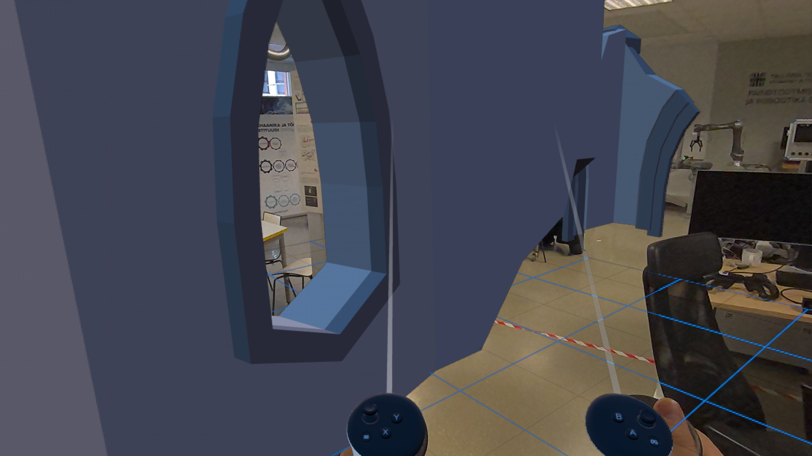

# r3f-locomotion 🚀 XR locomotion demo (react-three-fiber + @react-three/xr)



## Quick demo (local) 🖥️

Open a terminal and run (PowerShell):

```powershell
cd c:\Users\Admin\Documents\IVAR\r3f-locomotion
npm install
npm run dev
```

Then open `http://localhost:3000/locomotion` in your browser. 🌐

`app/locomotion/page.tsx` contains the full-screen demo page with VR entry button and controller-based locomotion. 🎮

`package.json` lists the project scripts and core dependencies (Next.js, three, @react-three/fiber, @react-three/drei, @react-three/xr). 🧩

## Highlights ✨

- Small, focused demo page at `/locomotion` that demonstrates VR enter, XR controller locomotion, and a GLTF model loaded from a public URL. 🕶️
- Built on Next.js + r3f + drei + @react-three/xr so it works well with modern React apps and Vercel deployments. ⚡

## Controls and usage 🎛️

- VR controllers: The demo maps controller input to locomotion. Typical interactions include pushing the joystick/thumbstick to move (forward/back/strafe) and pressing/twisting to rotate. The exact mapping is implemented in `app/locomotion/page.tsx`. 🕹️
- Teleport vs smooth locomotion: This demo is focused on smooth locomotion via controller input. 🏃
- Non-XR fallback: In desktop browsers without WebXR, the scene renders so you can inspect models and camera, but controller-driven locomotion will not be available. 🔍

## Notes and tips for publishing 📦

- HTTPS / secure origin: WebXR requires secure origins (HTTPS or localhost). The dev server uses `next dev --experimental-https` to help with this locally. 🔒

## Architecture & dependencies 🏗️

- Next.js 16 — app router
- react 19
- three, @react-three/fiber — rendering
- @react-three/drei — helpers and loaders
- @react-three/xr — WebXR integration and controller input

## Contributing ❤️

- Open an issue or pull request with suggested changes. Small, focused PRs (fixes, asset bundling, documentation improvements) will be accepted. 🙌
